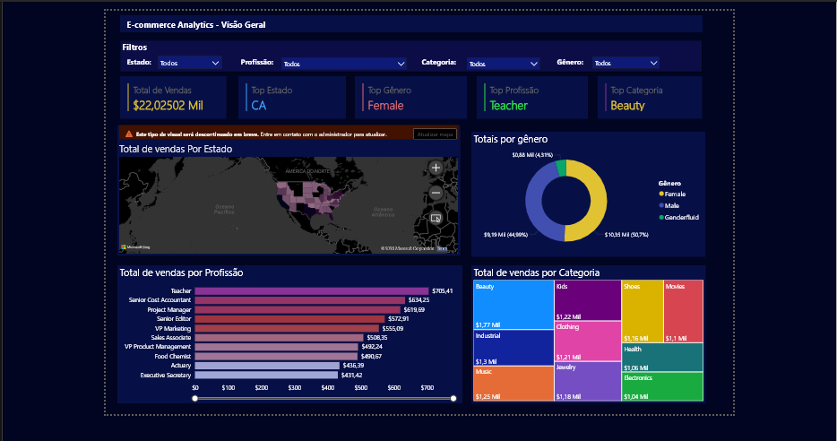

# 📊 Dashboard E-commerce Analytics — Power BI

> Dashboard interativo de análise de vendas para e-commerce, desenvolvido no Power BI com foco em exploração de dados por estado, gênero, profissão e categoria de produto.

---

## 🖼️ Preview



---

## 🎯 Contexto de Negócio

Este projeto simula o ambiente analítico de uma empresa de e-commerce que precisa monitorar e entender o comportamento de vendas em diferentes dimensões. O dashboard foi construído para responder perguntas estratégicas como:

- **Onde** estão concentradas as vendas? (por estado)
- **Quem** compra mais? (por gênero e profissão)
- **O que** vende mais? (por categoria de produto)
- **Quais** são os segmentos mais rentáveis?

---

## 📁 Estrutura do Repositório

```
dashboard-ecommerce-powerbi/
│
├── dashboard-visao-geral.png                    # Prints e imagens do dashboard
│
├── ecommerce_dataset.csv                        # Dataset utilizado (CSV)
│
├── Dashboard_Ecommerce.pbix        # Arquivo Power BI
└── README.md
```

---

## 📌 Páginas do Dashboard

| Página | Descrição |
|--------|-----------|
| **Capa** | Apresentação do projeto com KPIs de destaque |
| **Visão Geral** | Panorama completo de vendas por estado, gênero, profissão e categoria |
| **Análise Detalhada** | Matriz e tabela com drill-down por dimensões |

---

## 📈 Visuais Utilizados

- **Cartões (Cards)** — Total de Vendas, Top Estado, Top Gênero, Top Profissão, Top Categoria
- **Mapa** — Total de vendas por estado (geográfico)
- **Gráfico de Rosca** — Distribuição de vendas por gênero
- **Gráfico de Barras Horizontais** — Ranking de vendas por profissão
- **Mapa de Árvore (Treemap)** — Total de vendas por categoria de produto
- **Matriz** — Análise cruzada de dimensões *(em construção)*
- **Tabela** — Detalhe transacional *(em construção)*
- **Segmentações (Slicers)** — Filtros por Estado, Profissão, Categoria e Gênero

---

## 🔧 Técnicas e Recursos Aplicados

### Power Query
- Importação e limpeza do dataset
- Tratamento de tipos de dados
- Renomeação e padronização de colunas

### DAX (Data Analysis Expressions)
- Medidas para cálculo de total de vendas
- Métricas de ranking (Top Estado, Top Gênero, Top Profissão, Top Categoria)
- Cálculos percentuais para o gráfico de rosca

### Design
- Tema escuro personalizado
- Paleta de cores consistente por dimensão
- Layout responsivo com filtros globais no topo

---

## 🗂️ Fonte dos Dados

| Item | Detalhe |
|------|---------|
| **Origem** | Dataset fictício |
| **Formato** | CSV |
| **Dimensões** | Estado, Gênero, Profissão, Categoria, Valor de Venda |

> Os dados são fictícios e utilizados exclusivamente para fins educacionais e de portfólio.

---

## 🚀 Como Abrir o Projeto

1. Faça o download do arquivo `Dashboard_Ecommerce.pbix`
2. Abra o [Power BI Desktop](https://powerbi.microsoft.com/pt-br/desktop/) (gratuito)
3. Vá em **Arquivo → Abrir** e selecione o `.pbix`
4. O dashboard estará pronto para exploração e filtragem interativa

---

## 👩‍💻 Autora

**Bruna S. R. Santos**
* 🔗 LinkedIn: [www.linkedin.com/in/brunasrsantos](https://www.linkedin.com/in/brunasrsantos)
* 📧 Email: brunasrsantos@gmail.com

---

## 📝 Licença

Este projeto está licenciado sob a **MIT License**.

> 📌 *Projeto em construção — novas páginas e análises sendo adicionadas.*
